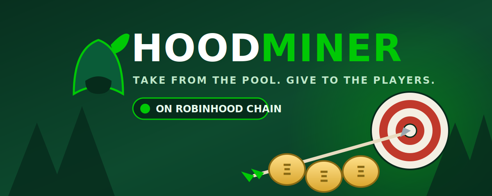

# ⛏️ Welcome to HoodMiner

## [HoodMiner](use-cases/official-links.md) is the mining game of Robinhood Chain: hold $HOOD, recruit Hoods, and earn up to 12% a day.

Three words run the whole game:

1. **What is $HOOD?**\
   The project token — fair-launched on [pons.family](https://pons.family), fixed supply, no presale, no team allocation. Every part of the game is denominated in it: you deposit $HOOD, you earn $HOOD. The only official token address lives in [The Hood Contract](use-cases/hood-contract.md).
2. **What are "Hoods"?**\
   Hoods are the miners you recruit with $HOOD. They work around the clock — every Hood you own mines non-stop, and the **Loot** it produces is yours to compound or claim.
3. **My daily percentage?**\
   Up to **12% per day**, depending on your habits: compounding pushes your rate toward the cap, claiming decays it temporarily. The realistic average is 8–10%. Full mechanics in [The Algorithm](product-guides/algorithm.md).

## The flywheel

Every trade of $HOOD — on the pons curve or the DEX after graduation — pays a creator fee. Half of HoodMiner's share **buys $HOOD back forever**: half of every buyback is **burned** (the supply is fixed, so it only ever shrinks), the other half is **deposited into the mine's pool**, paying the miners. The rest funds development and marketing.

Trading volume feeds the mine. The mine locks supply out of the float. That is the loop.

## Why Robinhood Chain?

* **Fees measured in cents** — compounding every day is actually viable, unlike on mainnet.
* **Ethereum security** — Robinhood Chain settles to Ethereum.
* **A brand-new frontier** — new chain, new attention, and no established mining game. First-mover Loot for everyone reading this early.

And the name? It comes from the chain: HoodMiner is the miner game built for Robinhood Chain.

## How to start

1. **Bridge ETH** to Robinhood Chain (guide in the dApp).
2. **Buy $HOOD** — on [pons.family](https://pons.family) while the token is on the curve, or on the DEX after graduation. Only use the address published in [The Hood Contract](use-cases/hood-contract.md).
3. **Connect your wallet** at the official dApp — see [Official Links](use-cases/official-links.md). Bookmark it; never trust links from DMs.
4. **Recruit Hoods** — approve and deposit $HOOD; the contract converts it to Hoods instantly.
5. **Compound or claim** — grow your Hoods or [take the Loot](product-guides/take-the-loot.md). Your call, every day.


HoodMiner is an independent community project. It is **not affiliated with, endorsed by, or connected to Robinhood Markets, Inc.** in any way. We simply build on Robinhood Chain.



**Read this before you buy or deposit.** All mining rewards are paid in $HOOD from the contract's pool — a shared pot of deposits, plus buyback top-ups. Rates are variable, not guaranteed, and claims are only possible while the pool holds $HOOD. The market price of $HOOD is set by traders, not by us — your yield is denominated in tokens, not dollars. Never put in more than you can afford to lose. This is a game, not a savings account.

